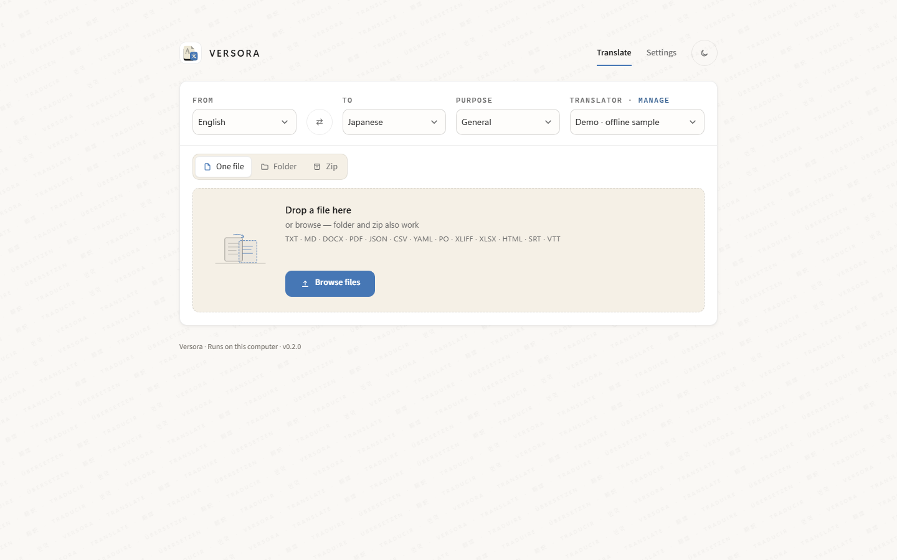
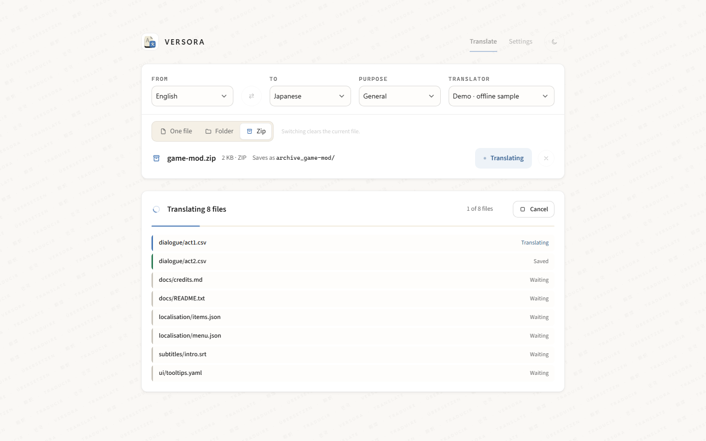
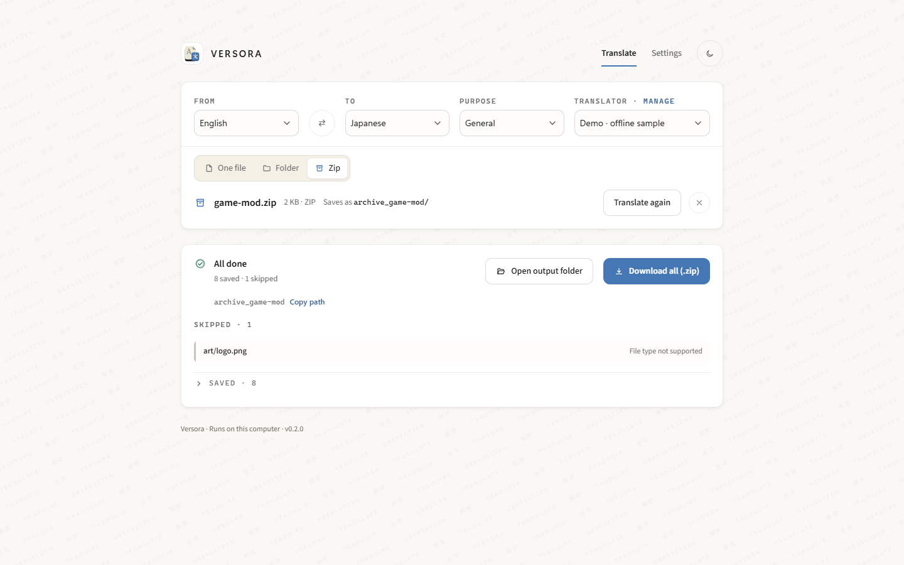
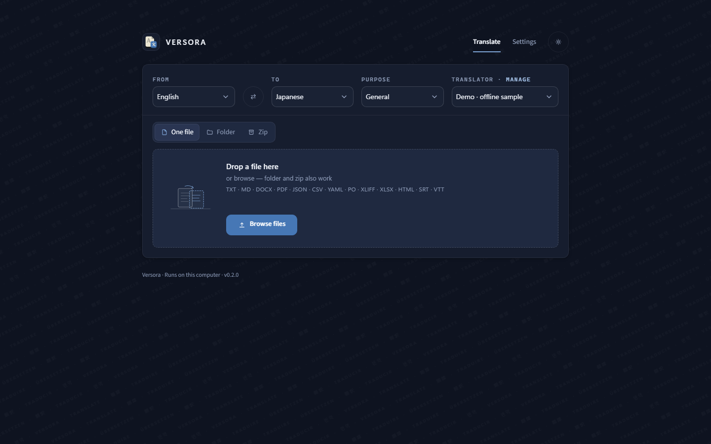
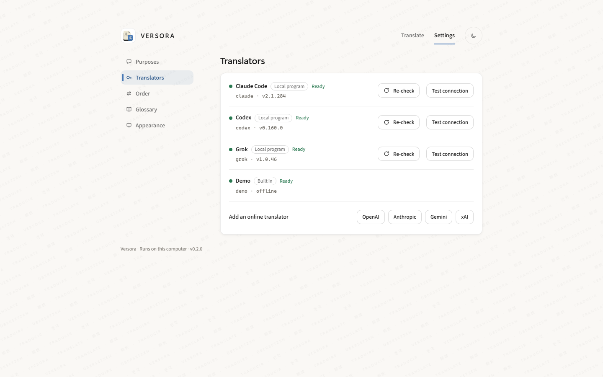

# Versora

Translate files on your own computer. Drop one file, a folder, or a zip — you get a matching translated file for each input, in the same folder shape.

Versora was called Smart File Translation System until v0.1.1. Old links still work.

*Pick the languages, drop a file, press Translate.*

## What it does

It reads txt, md, docx, pdf, json, csv, tsv, yaml, po, xliff, xlsx, html, srt, and vtt. Game-text mode changes only the words players see. A glossary keeps important terms consistent later.

The screen comes in 12 languages, light or dark. You pick the model. Folder and zip jobs can run 1–8 files at a time (default 2). Finished files go to `data/outputs/`, and you can download them in the browser.

It uses official developer APIs (OpenAI, Anthropic, Gemini, xAI, and others). If the official Grok CLI or Codex CLI is already installed and signed in on this computer, you can use those too. Chat websites are not supported.

You can check for official updates in the app, or just start it — at most once a day.

*Each file shows its own state while the job runs. Cancel keeps what is already done.*

*Download everything as one zip, open the output folder, or retry the files that failed.*

*Dark mode.*

*Settings: appearance, translator and model, keys, glossary.*

## How to use

1. Download this folder from GitHub (green **Code** button → **Download ZIP**) and unzip it.
2. On Windows, double-click `start.bat`. On Mac or Linux, run `./start.sh` from this folder.
3. Wait for the browser. The first start can take a few minutes. The starter installs what it needs and opens the app. An existing `.env` is left alone.
4. If it asks for a key, put the key in `.env` in this folder, save, and start again.

To look around without a key, start it with `SFTS_DEMO=1`. A Demo translator appears. It does not translate; it tags each line with the target language.

## Keys stay here

Keys live only in a local `.env`. The repository has no secrets. For extra options later, add them in that same file.

## Updates

### v0.2.0

- New name: Versora. New look, light and dark.
- Pick From / To languages and swap them right on the Translate page. The translator and model show next to them.
- Your last languages, file type and text mode are remembered, also after visiting Settings.
- Progress while translating, file by file, with Cancel.
- Folder and zip jobs: download everything as one zip, open the output folder, retry only the failed files. Failed and skipped files are listed apart, in plain words.
- A file with the same name is no longer overwritten; the new one gets a time stamp.
- Fixes: glossary rows no longer shift when one is deleted; the update check shows that it is working; temporary files are cleaned up.
- Needs Streamlit 1.40 or newer.

### v0.1.1

- One-click start: `start.bat` (Windows) and `start.sh` (Mac / Linux).
- Folder and zip jobs write one output per input file, same folder shape.
- More types: json, csv, tsv, yaml, po, xliff, xlsx, html, srt, vtt.
- Game-text mode, plus a glossary for consistent terms.
- Official developer APIs only. Optional official Grok CLI / Codex CLI if already installed and signed in. No chat websites.
- Pick a model. Folder and zip jobs can run 1–8 files at a time (default 2).
- Official-package updates from the app or on start (at most once a day).
- Settings: Translate / Settings tabs, Appearance / Translation / Keys / Glossary, light and dark.

### v0.1.0

- First public version.

---

# Versora

在你自己的電腦上翻譯檔案。丟一個檔案、整個資料夾，或一個 zip——每個輸入檔都會得到對應的譯文，資料夾形狀相同。

Versora 在 v0.1.1 之前叫「智能檔案翻譯系統」。舊連結仍然有效。

*選好語言，丟一個檔案，按「翻譯」。*

## 能做什麼

支援 txt、md、docx、pdf、json、csv、tsv、yaml、po、xliff、xlsx、html、srt、vtt。遊戲文字模式只改玩家會看到的字。用語表讓重要用詞之後保持一致。

畫面有 12 種語言，淺色或深色。可選模型。資料夾／zip 一次可跑 1–8 個檔（預設 2）。譯文在 `data/outputs/`，也可以在瀏覽器下載。

用官方開發者 API（OpenAI、Anthropic、Gemini、xAI 等）。如果這台電腦已安裝並已登入官方 Grok CLI 或 Codex CLI，也可以用。不支援聊天網站。

可在程式裡檢查官方更新，或直接啟動——一天最多查一次。

*翻譯時每個檔案各自顯示進度。按「取消」會保留已完成的檔案。*

*可一次下載全部（zip）、打開輸出資料夾，或只重試失敗的檔案。*

*深色模式。*

*設定：外觀、翻譯服務與模型、金鑰、用語表。*

## 怎麼用

1. 從 GitHub 下載這個資料夾（綠色 **Code** 按鈕 → **Download ZIP**），解壓縮。
2. Windows：連按兩下 `start.bat`。Mac 或 Linux：在這個資料夾執行 `./start.sh`。
3. 等瀏覽器打開。第一次可能要幾分鐘。啟動檔會裝好需要的東西並打開程式。已有的 `.env` 不會被覆蓋。
4. 如果要你填金鑰，把金鑰寫進這個資料夾的 `.env`，存檔後再啟動一次。

沒有金鑰也想先看看：用 `SFTS_DEMO=1` 啟動，會多一個「示範」翻譯服務。它不會真的翻譯，只會在每行前面標上目標語言。

## 金鑰留在這台電腦

金鑰只放本機 `.env`，倉庫不含密鑰。之後要改更多選項，寫在同一個檔就好。

## 更新

### v0.2.0

- 改名 Versora，換新外觀，有淺色和深色。
- 在翻譯頁直接選「原文／譯成」語言，也可以對調；旁邊顯示用哪個翻譯服務和模型。
- 會記住上次的語言、檔案類型和文字模式，去過設定頁回來也不會變。
- 翻譯時逐個檔案顯示進度，可以取消。
- 資料夾／zip：一次下載全部、打開輸出資料夾、只重試失敗的檔案。失敗和略過分開列出，用白話說明。
- 同名檔案不再被覆蓋，新檔會加上時間。
- 修正：刪除用語不會再令其他行錯位；檢查更新時會顯示進行中；暫存檔會清走。
- 需要 Streamlit 1.40 或以上。
